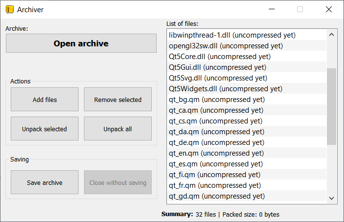
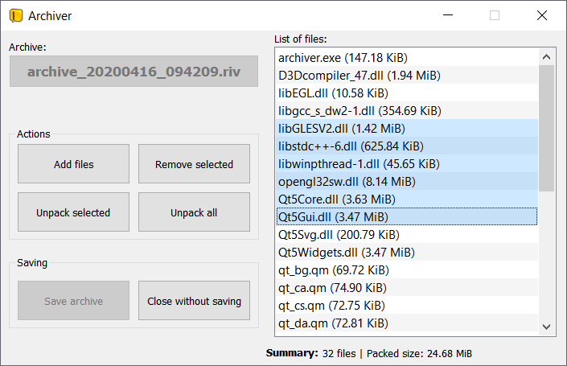

# Archiver
Simple archiver written in C++

#### Used:
 - C++
 - [QT](https://www.qt.io/) 5.11.1
 - [LZ4](https://github.com/lz4/lz4) compression library

**Download**: [Github release](https://github.com/rivit98/qt_archiver/releases)

**Presentation**: [YouTube](https://www.youtube.com/watch?v=Do9_Ounj6yM)

#### TODO:
* compressing big files
* folder compressing support
