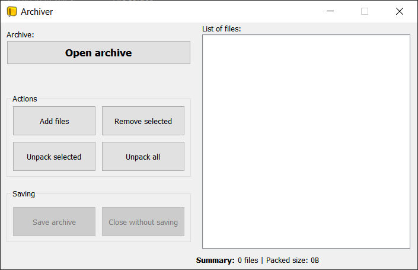

# Archiver
Simple archiver written in C++

#### Used:
 - C++
 - QT 5.11.1
 - LZ4 compression library

**Download**: [Github release](https://github.com/rivit98/qt_archiver/releases)

**Presentation**: [YouTube](https://www.youtube.com/watch?v=3C1qZQTDcUo)

#### TODO:
* compressing big files
* folder compressing support